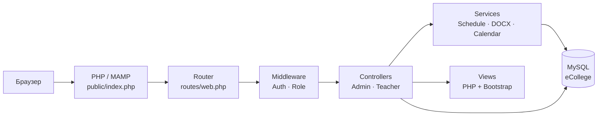
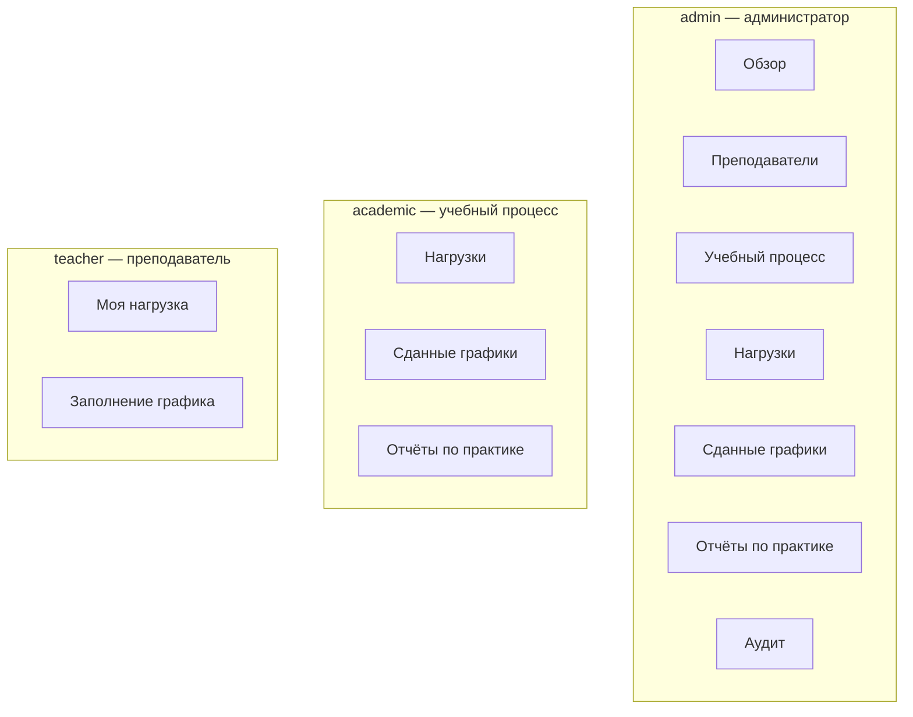
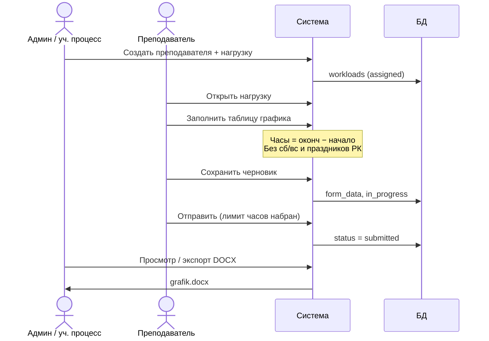
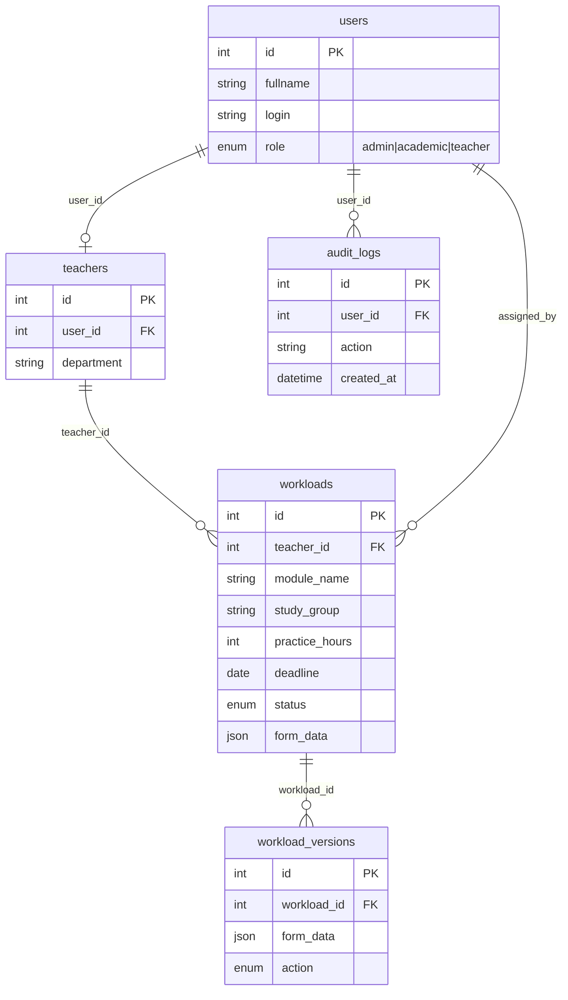

# Графики преподавателей

Веб-система для назначения нагрузки практики, заполнения графиков преподавателями и контроля сдачи.

## Архитектура



## Роли и разделы



## Процесс работы



## Модель данных



## Заполнение графика преподавателем

На странице нагрузки преподаватель заполняет таблицу (можно добавлять строки):

| Поле | Примечание |
|------|------------|
| Наименование модуля | В первой строке подставляется модуль из назначения |
| Раздел | |
| Тема | |
| Дата проведения | Календарь |
| Начало | Например: `08:30` |
| Окончание | Например: `14:00` |
| Часы | Считаются автоматически (окончание − начало) |
| Место проведения | Аудитория, адрес |
| ДОТ | Если отмечено — место проведения обязательно (платформа, ссылка) |

**Подсчёт часов:** сумма по строкам до лимита нагрузки (например 36 ч.). Не учитываются суббота, воскресенье и праздники Казахстана (`app/config/kazakhstan_holidays.php`).

Действия: **Сохранить черновик** или **Отправить** (нужно набрать лимит часов).

## Инструкция запуска

### Требования

| Компонент | Версия |
|-----------|--------|
| PHP | 8.0+ (расширения: `pdo_mysql`, `json`, `zip`, `mbstring`) |
| MySQL | 5.7+ / MariaDB 10.3+ |
| Веб-сервер | Apache (MAMP) или nginx + PHP-FPM |
| Composer | опционально (импорт Excel) |

### 1. Клонирование и размещение

Проект должен лежать в каталоге веб-сервера, например:

```
/Applications/MAMP/htdocs/ecollege/
```

### 2. Конфигурация

Файлы `app/config/app.php` и `app/config/database.php` не хранятся в git — создайте их из примеров:

```bash
cd /Applications/MAMP/htdocs/ecollege
cp app/config/app.example.php app/config/app.php
cp app/config/database.example.php app/config/database.php
cp .htaccess.example .htaccess
cp public/.htaccess.example public/.htaccess
```

Отредактируйте **`app/config/app.php`**:

- `url` — полный адрес сайта (порт MAMP часто **8888**): `http://localhost:8888/ecollege`
- `web_base` — путь к проекту: `/ecollege`

Отредактируйте **`app/config/database.php`**:

- `host`, `port` — для MAMP MySQL обычно `127.0.0.1` и **`8889`**
- `dbname` — имя базы (в `schema.sql` создаётся **`ecollege_schedules`**)
- `user` / `pass` — обычно `root` / `root`

> Если в `database.php` указано другое имя БД (`ecollege`), либо измените `dbname`, либо в `schema.sql` замените `ecollege_schedules` на нужное имя перед импортом.

В **`public/.htaccess`** проверьте `RewriteBase` — он должен совпадать с `web_base` + `/public/`.

### 3. База данных

Запустите **MAMP** (Apache + MySQL) или свой MySQL-сервер.

**Вариант A — командная строка:**

```bash
/Applications/MAMP/Library/bin/mysql -uroot -proot -P8889 < database/schema.sql
```

**Вариант B — phpMyAdmin:**

1. Откройте `http://localhost:8888/phpMyAdmin`
2. Импортируйте файл `database/schema.sql`

**Миграции** (если БД уже была создана ранее):

```bash
php database/migrate_workload_study_group.php
php database/migrate_academic_role.php
```

Через PHP MAMP:

```bash
/Applications/MAMP/bin/php/php8.2.0/bin/php database/migrate_academic_role.php
```

### 4. Composer (опционально)

Нужен только для импорта Excel (`phpoffice/phpspreadsheet`):

```bash
composer install
```

### 5. Права на каталоги

При первом запросе создаются папки в `storage/uploads/`. Если ошибка записи:

```bash
chmod -R 775 storage
```

### 6. Запуск

1. Включите **Apache** и **MySQL** в MAMP
2. Откройте в браузере адрес из `app/config/app.php`, например:

   **http://localhost:8888/ecollege**

3. Страница входа: `/login`

### 7. Демо-аккаунты

| Логин | Пароль | Роль |
|-------|--------|------|
| `admin` | `password` | Администратор |
| `uchebny` | `password` | Учебный процесс |
| `ivanov` | `password` | Преподаватель |

### 8. Проверка работы

- Вход под `admin` → раздел **Обзор**
- **Преподаватели** → добавление / редактирование
- **Нагрузки** → назначение практики
- Вход под `ivanov` → **Моя нагрузка** → заполнение графика
- **Сданные графики** → экспорт DOCX (шаблон `grafik.docx` в корне проекта)

### 9. Частые проблемы

| Симптом | Решение |
|---------|---------|
| `Database connection failed` | Проверьте MySQL, порт, `database.php`, импорт `schema.sql` |
| 404 на `/admin`, `/login` | Создайте `.htaccess`, включите `mod_rewrite`, проверьте `RewriteBase` |
| Неверные CSS/ссылки | Совпадение `url` и `web_base` с реальным путём в браузере |
| `Unknown column 'study_group'` | `php database/migrate_workload_study_group.php` |
| Ошибка роли `academic` | `php database/migrate_academic_role.php` |

### Прототип (без БД)

Интерактивный макет интерфейса:

**http://localhost:8888/ecollege/public/prototype.html**

## Админ

1. Добавить преподавателя + нагрузку (модуль, часы, срок сдачи)
2. Просмотр сданного графика — в карточке нагрузки
3. Экспорт — `admin/submissions/export` (шаблон `grafik.docx`)

## Прототип интерфейса

Интерактивный макет: [public/prototype.html](public/prototype.html)
